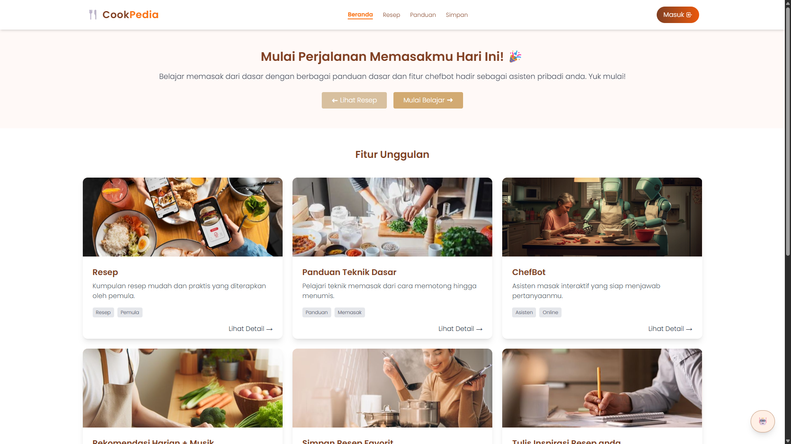

# CookEasy

CookEasy is a web-based application designed to guide users through cooking techniques, recipes, and kitchen skills. This project combines structured recipe content, categorized cooking methods, and a friendly user interface for both novice and intermediate home cooks.

## 📁 Project Structure

```
cookeasy_project/
├── index.html                # Homepage
├── assets/
│   └── css/                  # Stylesheets for all pages
│       ├── index.css
│       ├── guide.css
│       ├── detailResep.css
│       ├── frying.css
│       ├── boiling.css
│       └── ...and more
```

## 🧑‍🍳 Features

* Interactive homepage and navigation.
* Step-by-step cooking guides (e.g., frying, boiling, baking).
* Individual recipe detail pages (e.g., Pancake, Nasi Goreng, Ayam Goreng).
* Sections on cooking techniques: cutting, cleaning, knife usage.
* Daily recommendations and chef assistant interface.
* User profile & password management mockup pages.

## 🛠️ Built With

* **HTML5** – Markup structure
* **CSS3** – Page styling and layout
* **JavaScript** – Interactive behavior and dynamic UI (planned)
* **Tailwind CSS** – Utility-first CSS framework (planned or partially integrated)
* **Google Fonts** – Custom font integration
* **AJAX** – For asynchronous requests (planned or partially implemented)

## 📸 Screenshots



## 🚀 Getting Started

1. Clone or download the repository.
2. Open `index.html` in your browser.
3. Navigate through the application.

```bash
git clone https://github.com/VivianWijaya06/ALP4-Frontend.git
cd cookeasy_project
open index.html
```

## 📌 TODO

* Add responsive design for mobile and tablet views.
* Implement complete JavaScript functionality.
* Integrate user login system and external recipe API.

## 📄 License

MIT License. See [LICENSE](/LICENSE.txt) for more info.
